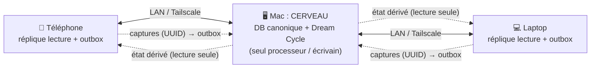
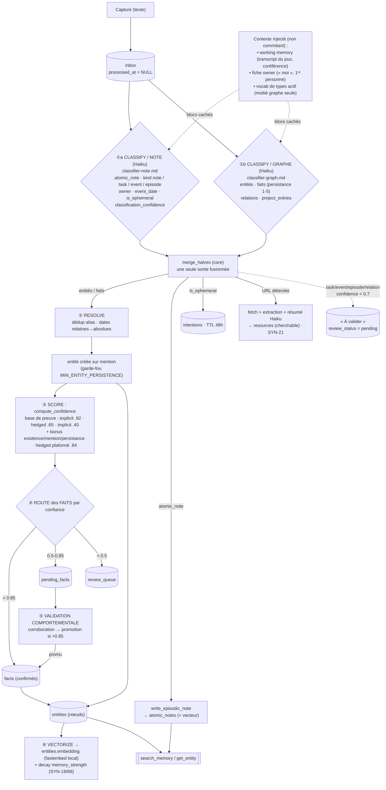
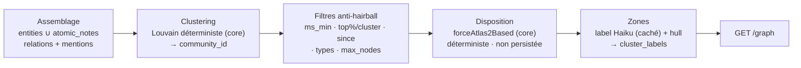
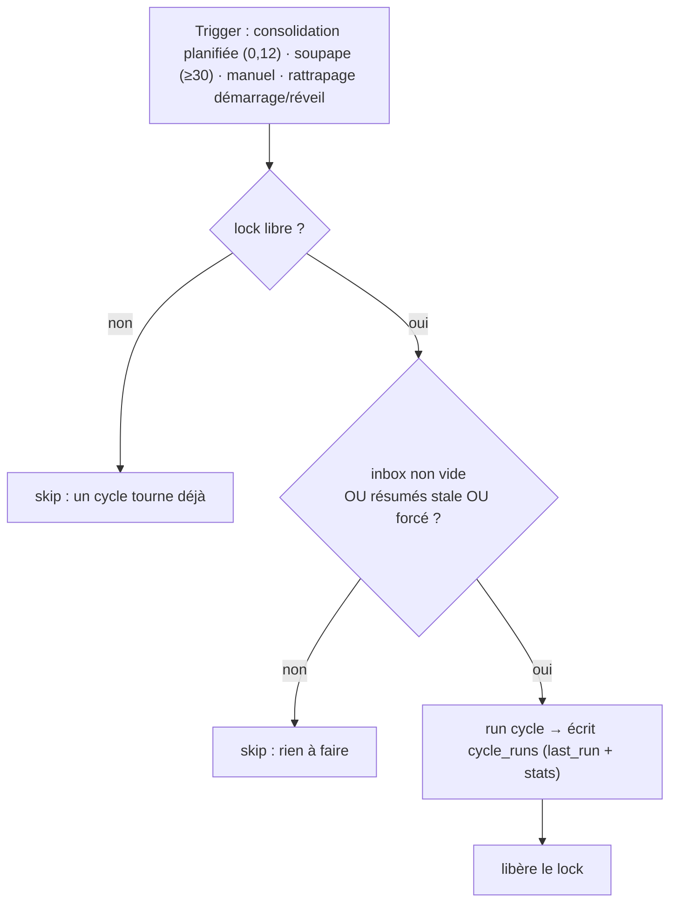
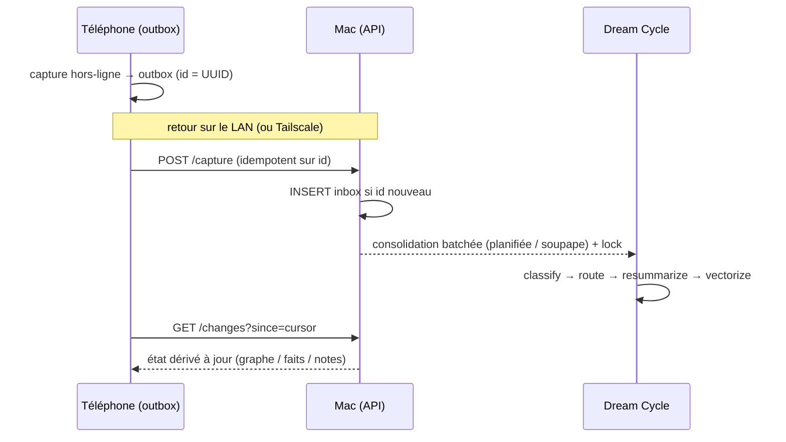

# sinam : Spec technique actuelle (prod)

> Architecture réelle du système : ce qui tourne aujourd'hui. Les pistes restantes sont listées en §12, §13.

Philosophie : **« capture passive, traitement actif »**, **100 % local-first, 0 % cloud**. On capture tout (texte), une IA (Claude Haiku) nettoie/relie/structure, une base locale rend le tout consultable et mémorisable durablement.

---

## 1. Topologie de déploiement

Un **cerveau** (Mac, toujours allumé) ; les autres appareils sont des **répliques en lecture + une outbox de captures**. Aucun cloud : synchro sur le LAN, ou via Tailscale (réseau privé chiffré) en déplacement.

Règles :
- **Un seul processeur** (le Mac « cerveau ») fait tourner le Dream Cycle et écrit l'état dérivé (entités/faits/notes). Évite la divergence multi-maître.
- Les **captures** remontent de partout, append-only, **clé = UUID** → conflit-free.
- L'**état dérivé** redescend en lecture seule → flux à sens unique, rien à fusionner.
- Chaque appareil garde une **copie locale complète** → consultation **hors-ligne, partout**. Seule la *transformation* des nouvelles captures attend de joindre le cerveau.
- **Isolation LAN** : chaque installation porte un bearer token propre (`SYNAPSE_API_TOKEN`) ; le backend n'est joignable qu'avec lui (auth désactivée = dev seulement).

---

## 2. Flux de traitement : le Dream Cycle

Un seul cycle, par entrée d'inbox. **Le routage est non-exclusif** : une même capture peut produire à la fois des entités, une note atomique, une entrée projet, une intention et une ressource (`_process_entry`). Il n'y a **pas de type d'entrée** qui arbitrerait entre ces sorties : `input_type` a été retiré en SYN-171, il ne pilotait rien et n'offrait au modèle qu'une cinquième façon de se tromper. Chaque sortie est décidée par le champ qui la porte.

**Depuis SYN-171 la classification est en DEUX appels** (§2quater) : une moitié décide le routage et écrit la prose, l'autre extrait le graphe. Elles sont indépendantes, et fusionnées dans le core.

Code : le moteur vit dans le **cœur Rust partagé `sinam-core`** (§2ter) ; [dream_cycle/cycle.py](../dream_cycle/cycle.py) est l'orchestrateur hôte (boucle, Batch API, day context, clé). Déclenché par la consolidation batchée (§2bis), `python -m dream_cycle`, ou le tool MCP `run_dream_cycle`.

**Résilience par entrée** : chaque entrée est traitée isolément. Une `anthropic.APIError` (clé absente/invalide, réseau) **avorte le run entier** et laisse les entrées en file pour un retry ; une erreur de contenu sur une entrée la marque `status='failed'` (raison dans `inbox.error`, exposée sur `/feed`) et le run continue.

---

## 2bis. Deux temporalités : working memory + consolidation batchée (SYN-93)

Comme la consolidation du sommeil : la capture **bufferise** pendant la « journée », le traitement tourne en une **passe batchée** (« sommeil »).

- **Working memory (coréférence)** : `_build_day_context` fournit au classifieur un **transcript en lecture seule** du batch + des captures récemment consolidées (fenêtre 24h) sous forme de **bloc caché**. « il / elle / ce projet / hier » se résout **d'une capture à l'autre** au lieu de classer chaque entrée dans le vide. Le bloc **ne commit rien** : seule la capture courante produit des sorties.
- **Déclenchement batché** : le scheduler (`api/app.py::_should_consolidate`) ne tourne plus toutes les ~2 min. Les captures attendent une **heure locale planifiée** (`SYNAPSE_CONSOLIDATION_HOURS`, défaut `"0,12"` = minuit + midi, deux fois par jour) **ou** une **soupape de taille** (`SYNAPSE_CONSOLIDATION_MAX_QUEUED`, défaut 30).
- **Rattrapage (laptops testeurs)** : la passe planifiée n'est pas un « tir à l'heure pile » : elle tourne si le dernier créneau planifié est passé et qu'on n'a pas consolidé depuis (persisté via un marqueur `last_consolidation` dans `SYNAPSE_HOME`). Un créneau manqué parce que le Mac dormait est rattrapé au tick suivant du scheduler, **y compris le tout premier au démarrage**. Miroir du self-heal du digest.
- **Batch API (-50 %)** : la passe planifiée classe tout le batch via la **Message Batches API** (`_batch_classify`, classify-only : submit → poll → results). Depuis SYN-171 elle soumet **deux requêtes par capture** (`e{id}#note` et `e{id}#graph`) ; `_classify_params(entry, conn, day_context, half)` prend la moitié explicitement, et la fusion est faite par le core. Une capture à qui il manque une moitié **n'est pas à moitié classée** : elle repart en synchrone, parce qu'écrire un demi-résultat perdrait tout le graphe en silence. Sélection : `_should_consolidate` renvoie `'scheduled'` → batch, `'valve'`/`'stale'` → synchrone (immédiateté). Best-effort : tout échec submit/poll retombe en synchrone, le cycle ne cale jamais.

> Conséquence assumée : une requête en milieu de journée ne voit pas les captures non encore consolidées tant que le batch n'a pas tourné. `SYNAPSE_CYCLE_DEBOUNCE_SECONDS` est **legacy/inutilisé** depuis SYN-93.

---

## 2ter. Le cœur Rust partagé : `sinam-core` (SYN-96)

Depuis l'epic SYN-96 (T1→T5), **le cerveau est compilé une seule fois** (repo public `sinam-core`, Apache-2.0) et consommé partout : ce backend via une wheel PyO3 (`sinam_core`), les apps mobiles via UniFFI — zéro divergence de logique entre plateformes, l'iPhone/Android route les captures **on-device** avec exactement ce moteur.

Répartition :

| Dans le core (Rust) | Côté hôte (ce repo, Python) |
|---|---|
| Schéma SQLite + **seule** bibliothèque SQLite du process (sqlite-vec compilé) | API HTTP + MCP (surfaces) |
| Embeddings (fastembed/ort, vecteurs bit-identiques) | Orchestrateur du cycle (`cycle.py` : boucle, erreurs par entrée) |
| Classification (HTTP, provider-agnostique `llm.rs`) + **routing complet** (`routing.rs`) + fusion des deux moitiés (`merge_halves`) | Batch API (SDK anthropic) + working memory (day context) |
| Decay Ebbinghaus (`decay.rs`) · resummary + synthèse projet (`summaries.rs`) | Résolution de clé + fuel proxy (`_llm_args`, SYN-105) |
| Digest hebdo (`digest.rs`) · ressources fetch/extract/résumé (`resources.rs`) | Scheduler (consolidation, self-heal digest), launchd |
| Sync P2P (`sync.rs`, §13) · migrations (`migrate.rs`) | Shims à signatures historiques (`facts_store`, `dream_cycle/decay|digest|resources`) |
| Coût par appel LLM (`usage.rs`, SYN-160) · appairage (`pairing.rs`) | Endpoints d'appairage et de sync (`api/sync_peers.py`) |
| Lecture locale (`snapshot.rs`) et écritures locales (`actions.rs`) pour les répliques mobiles | (sans objet : l'hôte lit et écrit par ses endpoints) |

Invariants :
- **Les prompts sont de la donnée** : versionnés dans le repo core (`prompts/*.md` + `manifest.json`, une version entière pour le jeu entier, **17** aujourd'hui), déployés dans `~/.synapse/prompts/` (`SYNAPSE_PROMPTS_DIR`). Éditer + redémarrer, pas de recompilation. ⚠ Déployer les prompts AVANT (ou avec) une wheel qui les lit.
- **« Déployé » se compte par surface** : un prompt est de la donnée **recopiée sur chaque surface**, et cette machine n'en est qu'une. Le même fichier vit dans `~/.synapse/prompts/` ici, sur la machine de prod, dans les **assets de l'app** Android et iOS (qui embarquent leur propre core), et dans le **backend bundlé** du `.dmg` / de l'installeur Windows. Éditer le repo core ne le livre **nulle part**.
- **Parité golden-testée** : `scripts/golden/` rejoue un corpus de classifications enregistrées et compare les écritures normalisées (224 lignes, 13 tables) entre l'implémentation figée (tag `python-legacy`) et le core. À relancer après tout changement de `routing.rs`.
- **Transactions** : ce qui doit s'exécuter dans la transaction du caller est exposé sur la **passerelle SQL** (`conn.insert_fact`, decay, `gather_week`, `add_project_entry`) ; les passes LLM/vecteurs (`Brain`) écrivent sur **leur propre connexion** et s'appellent **hors** `with conn:` (sinon SQLITE_BUSY).

---

## 2quater. Le classifieur en deux appels (SYN-171, 2026-08-21)

Le prompt unique faisait porter à une seule sortie **deux décisions qui se concurrencent** : router la capture (note / tâche / événement / épisode) et extraire le graphe. L'invariant « la note n'est jamais absorbée par les faits » devait être martelé à quatre endroits du prompt, et sautait dès qu'on le compactait.

Découpé, l'invariant devient **structurel** : l'appel graphe n'a pas de champ `atomic_note`, il ne *peut pas* le mettre à `null`. La règle disparaît du prompt au lieu d'y être répétée.

| Moitié | Décide | Sort |
|---|---|---|
| `classifier-note.md` | le routage et la prose | `atomic_note`, `atomic_note_kind` (`note`/`task`/`event`/`episode`), `atomic_note_owner`, `event_date`, `event_recurring`, `is_ephemeral`, `ephemeral_content`, `summary`, `classification_confidence` |
| `classifier-graph.md` | le graphe | `entities` + leurs `facts`, `relations`, `project_entries` |

Règles de mise en œuvre :

- **La fusion vit dans le core** (`llm::merge_halves`), jamais côté hôte : deux copies d'une règle de fusion dérivent, et la dérive serait muette, chaque moitié possédant ses propres clés (une mauvaise fusion perd des champs sans lever).
- **Une moitié ne lit que ce qu'elle peut écrire** : le vocab de types actif et le contexte projets ne sont injectés que dans la moitié graphe.
- `classifier.md` est conservé comme **repli documenté et référence de taille** ; le core ne le lit plus.
- **Mesuré** sur les 61 cas du harnais (Haiku, t=0) : routage **identique 61/61** face à la baseline validée de l'appel unique, 40 notes des deux côtés, aucun `kind` invalide.

Deux effets de bord à connaître **avant de retoucher la taille d'une moitié** :

1. **La moitié graphe sur-extrait** si rien ne l'en empêche. Libérée de la concurrence avec la note, elle est passée de 19 à 43 faits, dont « pain », « true » et un fait sur une négation. D'où la règle de sobriété en tête de `classifier-graph.md` : la liberté accordée porte sur la **suppression**, pas sur le **volume**, et `"facts": []` est la bonne réponse par défaut.
2. **Haiku ne met en cache un préfixe système qu'au-dessus de 4096 tokens.** L'appel unique (~5000) était caché, les deux moitiés (~2900 et ~2400) ne le sont plus. C'est une **falaise, pas une pente** : grossir une moitié au-delà du seuil coûte **moins** cher que la laisser juste en dessous. À l'échelle réelle (~100 captures/mois) l'écart mesuré est d'environ 0,20 $/mois.

**Multilingue (SYN-119)** : les prompts sont **EN-base**. Le squelette est anglais, la sortie suit la langue de la capture et n'est jamais traduite ; seul l'interlingua reste anglais (`atomic_note_kind`, `type` d'entité, `predicate`, `category`). Le classifieur émet un champ `language` (ISO 639-1) : détection **dans le prompt**, zéro appel et zéro dépendance en plus, stockée en `atomic_notes.language`. Les résumés d'entité, qui ne peuvent pas inférer la langue depuis des prédicats anglais et des noms propres, passent par un **vote majoritaire déterministe** sur les notes. Garde-fou : `scripts/lang_harness.py`.

**Harnais de parité modèles** : `scripts/parity/` rejoue un corpus de captures sur le modèle réellement en production (les **moitiés de prod**, pas une variante), imprime le coût de chaque run, et compare à des baselines versionnées (`scripts/parity/baselines/haiku-v*.json`, jusqu'à `v28`). ⚠ Ces numéros de baseline sont **ceux du harnais**, pas la version du jeu de prompts (`manifest.json`, 17).

---

## 3. Les leviers réglables (vision fonctionnelle)

| Levier | Où | Valeur | Effet |
|---|---|---|---|
| Barème persistance 1-5 | prompt `classifier-graph.md` | rubrique fixe | définit permanent ↔ bruit ; nourrit confiance + oubli |
| Base de preuve (confiance) | `compute_confidence` / `_EVIDENCE_BASE` | explicit .92 · hedged .65 · implicit .40 | point de départ selon la force de l'assertion ; + bonus existence/mention/persistance ; hedged plafonné à .84 |
| **`MIN_ENTITY_PERSISTENCE`** | `step4_route` | **2** | garde-fou anti-pollution : ↑ = moins d'entités ; 1 = crée pour tout ce qui est mentionné |
| Seuil consolidation `T_high` (faits) | `step4_route` | 0.85 | un **fait** > 0.85 est confirmé direct ; sinon pending (l'entité, elle, est créée sur mention) |
| Seuil pending `T_pending` | `step4_route` | 0.5 | borne basse « pending » vs `review_queue` |
| **Seuil « À valider »** | `cycle.py` | `SYNAPSE_REVIEW_CONFIDENCE_THRESHOLD` (0.7) | **partagé** tâches/événements/**épisodes** + relations (confiance auto-déclarée par le LLM, ≠ des bandes dérivées 0.85/0.5 des faits) |
| Heures de consolidation | scheduler API | `SYNAPSE_CONSOLIDATION_HOURS` (`"0,12"`) | quand la passe batchée tourne (minuit + midi) : SYN-93 |
| Soupape de taille | scheduler API | `SYNAPSE_CONSOLIDATION_MAX_QUEUED` (30) | force une passe si trop de captures en attente : SYN-93 |
| TTL intentions | `handle_intentions` | 48h | durée des rappels éphémères |
| **memory_strength decay** | core `decay.rs` (shim `dream_cycle/decay.py`) | τ = `SYNAPSE_DECAY_TAU_DAYS` (30j) | oubli gracieux Ebbinghaus sur **notes + entités** (SYN-19/68) |
| Seuil attache-projet | `cycle.py` | `_PROJECT_ATTACH_THRESHOLD_DEFAULT` (0.30) | proposition (non-forçante) tâche/intention → projet existant (point 1 C, abaissé de 0.55) |
| Attraction intra-cluster (carte) | `graph_layout.py` | `_INTRA_COMMUNITY_PULL` (3×) | cohésion spatiale des communautés au layout |
| Plafond de nœuds renvoyés (carte) | `GET /graph` | `max_nodes` (1000) | anti-hairball : ne renvoie jamais plus que les N plus saillants |
| **Seuil merge embedding** | `_propose_merge_by_embedding` | `SYNAPSE_MERGE_EMBEDDING_THRESHOLD` (0.85) | fusion auto de doublons (SYN-61) |
| **Prédicats single-valued** | core `routing.rs` (`SINGLE_VALUED_PREDICATES`) | liste statique | last-writes-wins / obsolescence (SYN-37) |
| Confiance validation manuelle | `validate_fact` | 0.95 | certitude quand l'utilisateur confirme |
| Modèle d'embedding | `config.py` | MiniLM multilingue 384-d | qualité/langue de la similarité |

> ℹ️ Depuis le découplage : l'**entité** est créée dès la 1ʳᵉ mention (si elle passe `MIN_ENTITY_PERSISTENCE` ou est dans une relation). Ses **faits**, eux, restent en pending tant qu'ils n'atteignent pas 0.85 → confirmés à la 2ᵉ mention ou par validation manuelle.

---

## 4. Validation humaine : la file « À valider »

Tout ce qui est **incertain n'est jamais jeté silencieusement** : c'est mis de côté, caché des vues de lecture, et proposé à la confirmation. Une file unique, plusieurs sources :

| Bucket | Condition | Où c'est stocké | Surfacé par | Confirmer / Rejeter |
|---|---|---|---|---|
| Faits pending | `compute_confidence` ∈ 0.5-0.85 | `pending_facts` | `GET /pending` | `POST /pending/{id}/validate` |
| Faits review | `compute_confidence` < 0.5 | `review_queue` | (interne) | : |
| **Tâches / événements / épisodes** | `classification_confidence` < 0.7 | `atomic_notes.review_status='pending'` + `review_reason` | `GET /atomic-notes?review_status=pending` | `POST /atomic-note/{id}/confirm` · rejet = `/archive` |
| **Récurrence annuelle** hors événement confiant | `event_recurring` posé sur autre chose qu'un `event` sûr | `atomic_notes.review_status='pending'` | idem | idem (SYN-182 C) |
| **Relations** | `confidence` (par relation) < 0.7 | `relations.review_status='pending'` | `GET /relations/pending` | `POST /relation/{id}/confirm` · rejet = `DELETE /relation/{id}` |
| **Attache-projet** | similarité tâche/intention ↔ projet ≥ 0.30 | `project_attach_proposals` | `GET /project-attach-proposals` | `.../accept` · `.../reject` |
| Types d'entité | type hors vocab actif | `entity_type_proposals` (`status='pending'`) | `GET /entity-type-proposals` | `POST .../accept|reject` (SYN-58) |
| Fusion d'entités | doublon substring/embedding | `entity_merge_proposals` | `GET /merge-proposals` | `POST .../accept|reject` (SYN-39/61) |
| **Fusion de prédicats** | un prédicat vu pour la 1ʳᵉ fois ressemble à un prédicat en usage | `predicate_merge_proposals` | `GET /predicate-proposals` | `POST .../accept|reject` (SYN-190) |
| **Négation d'un fait** | la capture nie un fait, mais la cible n'est pas certaine | `fact_negation_proposals` | `GET /negation-proposals` | `POST .../accept?fact_id=…|reject` (SYN-189) |
| **Renommage d'entité** | la capture déclare que l'entité s'appelle désormais X | `entity_rename_proposals` | `GET /rename-proposals` | `POST .../accept|reject` (SYN-188) |

Les éléments `pending` sont **exclus de toutes les surfaces de lecture** (listes par défaut, `/graph`, `/changes`, digest, régénération de résumé) tant qu'ils ne sont pas confirmés : un « à valider » ne peut pas polluer la mémoire ni l'embedding avant validation. Côté app : segments **Tâches** et **Liens** dans l'onglet « À valider ».

> **Un motif voyage avec la ligne (SYN-182 B).** La file ne couvrait que `task`/`event` : un épisode dont le modèle n'était sûr qu'à 0,2 était écrit `confirmed`. L'étendre lui ajoute un **second sens** (« je ne suis pas sûr que ça mérite d'exister », à côté de « je ne suis pas sûr de la date »), et deux sens dans une file la rendent inutilisable : d'où `atomic_notes.review_reason`, nommé et stocké sur la ligne. Décision correcte mais **inerte** à ce jour : aucun épisode n'est jamais passé sous 0,7, parce que le prompt ne demande de douter que sur deux frontières.
>
> **Quatre files disent la même chose : proposer, jamais appliquer.** Types
> d'entité, fusion d'entités, fusion de prédicats, renommage. L'invariant n'est
> pas « le modèle se trompe parfois », c'est **ce que l'erreur coûte** : chacune
> de ces écritures change l'IDENTITÉ de quelque chose que l'utilisateur lit
> comme étant sa mémoire, et une identité changée à tort ne se remarque pas. Une
> valeur fausse se corrige quand on la voit ; un nom canonique faux devient la
> vérité.
>
> **La négation est le seul cas où l'application peut être immédiate (SYN-189)**,
> et ce n'est pas une exception à la règle mais son application : périmer est
> RÉVERSIBLE (`obsoleted_at`, annulé par `/fact/{id}/restore`), là où renommer ou
> fusionner ne l'est pas. Quand la cible n'est pas certaine — la valeur niée
> diffère de celle en mémoire, le prédicat ne correspond qu'approximativement,
> ou rien ne correspond sur une entité qui porte pourtant des faits — la
> négation retourne en file comme les autres.
>
> **Le classifieur ne dit plus ses règles en prose (SYN-171).** La moitié note est une **table de décision** : une porte en tête (ce qui ne mérite aucune note), puis des lignes ordonnées. Le durcissement tâche-vs-éphémère de 2026-06-29, écrit à l'époque en paragraphes, y est absorbé : en cas d'hésitation « action durable vs éphémère », la consigne est de **ne pas jeter** et de choisir `kind="task"`. Une règle de récurrence, elle, n'est écrite **nulle part** en prose : le routage l'impose structurellement, jamais une répétition annuelle décidée par un modèle.

---

## 5. Le graphe explicite : faits vs relations (2026-06-30)

**Une relation = un fait dont l'objet est une entité nommée → plus de « redite ».** « Audric est le cousin d'Alexis » produisait AVANT et un fait (`is_cousin_of="Alexis"` sur Audric) ET une relation (Audric→Alexis). Désormais :
1. **Règle de prompt** : si l'objet d'un fait est une entité nommée que tu émets aussi, n'émets QUE la relation.
2. **De-dup défensif** dans `step4_route` : un fait dont la `value` matche la cible d'une relation de la même entité est **droppé** (Haiku est faillible, le filet de routage reste). Les faits à valeur littérale (`lives_in="Lyon"`) sont intacts.

La relation est la **forme canonique** : traversable, visible **des deux fiches**. `GET /entity/{id}` renvoie `relations` (sortantes) **et `relations_incoming`** (entrantes) → « Audric → cousin → Alexis » apparaît aussi sur la fiche d'Alexis. La réplique calcule la même chose hors-ligne.

**Relations sous garde de confiance** (elles persistaient en dur avant) : le classifieur émet une `confidence` par relation ; `relations.review_status='pending'` si < 0.7, sinon `'confirmed'`. Cachées de toute lecture tant que non confirmées.

**Dédup de fait sur re-mention (point 3b)** : `insert_fact` (core `routing.rs`, shim `facts_store`) détecte un fait actif identique (même entité+prédicat+valeur, insensible casse/espaces) et le **renforce** (`confidence ← max`, `last_confirmed` bumpé) au lieu de dupliquer la ligne.

> **La sérendipité est intacte** : elle tourne sur un canal séparé : cosinus sur `entity_embedding_text` (nom/type/aliases/attributs/résumé, **jamais faits ni relations**) + embeddings de notes. Le de-dup/gate n'affecte que le graphe explicite ; la proximité implicite (merge-by-embedding 0.85, attache-projet, « entités liées ») est inchangée.

---

## 6. Identité, projets & tâches

- **Owner / « moi » (point 2)** : les captures en 1ʳᵉ personne (« je », « j'ai », « mon », « moi ») se résolvent vers **ta propre entité** au lieu de créer un « auteur » fantôme. L'id owner vit dans `config.json` (`config_store.get_owner_entity_id`) ; `_load_owner_block` injecte un bloc classifieur (non caché) nommant l'owner. Endpoints `GET /owner`, `PUT /owner`.
- **PROJET vs TÂCHE (point 1)** : avant d'émettre `kind="task"`, une règle prioritaire du classifieur tranche : multi-étapes / horizon long = **PROJET** (→ `project_entries` + entité `type="project"`, nommée par domaine durable p.ex. « Escalade » pour que les progrès futurs se re-rattachent au même parapluie) vs tâche bornée = **TÂCHE**. Garde-fou : `type=project` seulement avec un `project_entries` correspondant.
- **Attache-projet → « À valider » (point 1 C/D)** : une tâche/intention proche d'un projet existant (≥ 0.30, avec marge anti-ambiguïté) file une **proposition non-forçante** (`project_attach_proposals`). Manuel : `POST /atomic-note/{id}/promote-to-project`.
- **Agrégat projet (SYN-40)** : `project_entries` (les briques), `project_state` (synthèse courante) + `project_state_versions` (historique). La synthèse s'append puis se refond au-delà d'un seuil de raffinement.

---

## 7. Modèle de données

SQLite (`~/.synapse/synapse.db`), extension `sqlite-vec`. **Le process n'a qu'une seule bibliothèque SQLite : celle du core.** Deux builds dans le même process (par exemple `apsw` et le SQLite embarqué du core) ne voient pas leurs verrous respectifs et corrompent la base. [db/__init__.py](../db/__init__.py) est donc un **adaptateur à la forme d'apsw** (`Connection`/`Cursor`, blocs `with` imbriquables) posé sur la passerelle SQL du core ; le code appelant n'a pas changé, la couche en dessous si. Schéma et migrations vivent dans le core (`schema.rs`, `migrate.rs`), idempotents.

| Table | Rôle | Niveau mémoire |
|---|---|---|
| `inbox` | captures brutes (`processed_at` NULL → à traiter) ; `error`, `client_id` (idempotent), `device_id`, `captured_at`, `status` | working |
| `atomic_notes` (+`atomic_notes_vec`) | mémoire épisodique ; `summary`, `entities_mentioned`, `memory_strength`, `kind`, `review_status` | épisodique |
| `entities` / `facts` / `relations` | graphe sémantique (ids = UUID) ; `entities.memory_strength` (decay SYN-68) ; `relations.review_status` | sémantique (∞) |
| `pending_facts` / `review_queue` | faits à valider / à revoir | : |
| `intentions` | éphémère (TTL 48h) | : |
| `validation_events` | journal append-only des validations (durable, réplicable) | : |
| `cycle_runs` | 1 ligne par run du cycle (stats `/dream-cycle/last`) | : |
| `resources` | URL fetchées + résumé + embedding (SYN-21) | sémantique |
| `entity_merge_proposals` | file de dédup d'entités (SYN-39/61) | : |
| `entity_type_proposals` / `active_entity_types` | vocab de types dynamique (SYN-58) | : |
| `project_entries` / `project_state` / `project_state_versions` | agrégat projet (SYN-40) | : |
| **`project_attach_proposals`** | propositions d'attache tâche/intention → projet (point 1 C) | : |
| `node_positions` | **table morte** : plus rien ne l'écrit ni ne la lit depuis que les positions ne sont plus persistées | — |
| `cluster_labels` | cache des labels Haiku par signature de cluster, SYN-70 | projection (carte) |
| `space` / `devices` | singleton d'espace répliqué + registre d'appareils (SYN-127/128) | : |
| `sync_log` / `sync_owner` | journal de versions HLC des tables répliquées + verrou de propriétaire (SYN-112) | : |
| `llm_usage` | une ligne par appel LLM, quatre compartiments de tokens (SYN-160) | : |
| `knowledge_graph` | legacy, **inutilisé** | : |

**Colonnes de cycle de vie** : `entities.status` (active/pending/archived) + `archived_at` ; `facts.archived_at`/`obsoleted_at`/`obsoleted_by` (SYN-37/59) ; `atomic_notes.last_reactivated_at` (decay SYN-19). Vues de lecture filtrent par défaut (`status='active'`, `archived_at IS NULL`, `obsoleted_at IS NULL`).

**Colonnes de provenance inverse (SYN-92)** : `provenance_capture_id` sur `entities`/`facts`/`atomic_notes`/`relations` → `GET /capture/{id}/generated` liste ce que le cycle a produit d'une capture donnée (inverse de la provenance).

**Notes typées (SYN-85/86/23, SYN-171, SYN-182)** : `atomic_notes.kind` ∈ `note|task|event|episode|digest` + `event_date` (date **absolue** résolue par le classifieur), `event_recurring` (récurrence annuelle), `archived_at` (geste user « rendre obsolète », réversible). Une **tâche** est un backlog retrouvable ; depuis SYN-23 elle peut porter une **échéance** (`event_date` sur `kind=task`) **sans devenir un événement** (event = ce qui *se produit* ; task = ce qu'on *fait*). Les notes durables traversent les gates éphémères ; une note routée projet mentionne toujours son projet.

**L'épisode (SYN-171)** : un vécu qui **affirme que quelque chose a eu lieu** (« j'ai déjeuné avec Manon »). Ce n'est ni une pensée durable ni une tâche, et le jeter serait perdre le seul récit du passé : il est **gardé mais décroît plus vite** qu'une note (`decay.rs`), et n'est jamais supprimé. Un ressenti n'est pas un accomplissement : « une course qui fait du bien » n'en est pas un.

**Deux colonnes ajoutées par SYN-182**, parce qu'une règle que le stockage ne sait pas représenter est **inexprimable**, quelle que soit la formulation du prompt :
- `atomic_notes.owner` (NULL = l'auteur). Depuis SYN-85 le classifieur promettait qu'une action rapportée n'atterrit « jamais comme celle de l'auteur » ; rien ne portait cette promesse. Le digest filtre dessus, pour les tâches ouvertes comme pour « à venir ». C'est **un nom, pas un identifiant d'utilisateur** : ce n'est pas le chantier multi-comptes.
- `atomic_notes.review_reason` : le motif nommé qui accompagne un `review_status='pending'` (§4).

Et **l'épisode garde sa date** : la porte `durable` (event|task) est devenue `dated` (event|task|episode). « Notre rencontre avec Marie était le 18 avril » partait bien en épisode (c'est passé), puis était écrit avec `event_date=NULL` : l'anniversaire de rencontre était détruit **à l'insertion**, avant qu'aucune règle de récurrence n'ait pu jouer.

**Catégories de faits (SYN-88)** : `facts.category` ∈ `identity|dates|work|places|relations|preferences|health|other`, propagée par `insert_fact` ; les clients groupent les faits en sections repliables.

**Résumé d'entité dérivé (SYN-89)** : `entities.summary_stale` posé à chaque écriture de fait ; `step_resummarize` régénère le résumé **from scratch depuis les faits ACTIFS + relations** (dérivé, jamais éditable ; règle **intemporelle**, dates absolues). Édition utilisateur = source de vérité : rename (ancien nom → **alias**), correction de fait (`confidence → 1.0`), CRUD relations.

**Embeddings** : **ONNX local dans le core** (`paraphrase-multilingual-MiniLM-L12-v2`, 384-d, L2-normalisé). Pas d'appel API pour embedder. Depuis **SYN-118** un texte long est **découpé** en fenêtres d'environ 128 tokens, un vecteur par fenêtre, le meilleur chunk l'emporte à la recherche : une note longue cesse d'être diluée dans une moyenne. `reembed.py` couvre toutes les surfaces. Notes dans `atomic_notes_vec` (vec0) ; entités en BLOB (`entities.embedding`) recherchées par cosinus manuel. Depuis **SYN-91**, `GET /changes` réplique l'embedding entité en base64 (`embedding_b64`) → le mobile calcule les « entités liées » (cosinus) **hors-ligne**.

---

## 8. Modèle du graphe : la carte vivante (SYN-66)

> La carte mentale n'est **pas** une table de plus : c'est une **projection** assemblée à la demande depuis le graphe existant. Aucune nouvelle source de vérité : un seul cache, `cluster_labels` (un appel LLM). Un recalcul complet ne perd rien. Exposée par `GET /graph`.
>
> **Elle est calculée par le core Rust** (`snapshot.rs`), pas ici : communautés, ressorts sémantiques et disposition. Le backend appelle `conn.read_graph()` et n'ajoute que les libellés de zone, qui demandent une clé d'API. Il en existait deux implémentations, une en Python et une en Rust, et la carte changeait donc selon qui avait répondu au dernier chargement ; il n'en reste qu'une. Le Python garde la vue ego, la liste d'entités et les filtres anti-pelote, qui n'ont pas d'équivalent dans le core. Code : [graph_layout.py](../graph_layout.py) (ressorts sémantiques), [graph_communities.py](../graph_communities.py) (Louvain, pour ces chemins-là), [graph_clusters.py](../graph_clusters.py), handler dans [api/app.py](../api/app.py).

**Deux natures de nœuds** : **Entités** (`entities`, id = uuid) : nœuds « durs » ; **Notes atomiques** (`atomic_notes`, id exposé `n:<rowid>`) : pensées libres, reliées sans devenir des entités.
**Deux natures d'arêtes** : **Relations** entité↔entité ; **Mentions** note→entité (dérivées de `entities_mentioned`).

| Variable visuelle | Donnée backend |
|---|---|
| Taille du neurone | `memory_strength` × `degree` |
| Couleur de zone | `community_id` (Louvain) |
| Saturation / vivacité | `memory_strength` (decay Ebbinghaus, SYN-19/68) |
| Forme | `kind` (entity / atomic_note) + `type` |
| Position (x, y) | **calculée par le core** (portage vis-network forceAtlas2Based), servie telle quelle en HTTP comme hors ligne ; l'app la lit, elle ne la recalcule plus |
| Épaisseur d'arête | `confidence` |

**Décisions de modèle** :

- **Une seule implémentation**, dans le core, pour que la carte en ligne et la carte hors ligne soient la même. Le déterminisme ne vient d'aucune graine : nœuds visités par id trié, égalités tranchées explicitement, partition renumérotée canoniquement (taille décroissante, puis plus petit id membre).
- **Positions non persistées.** `node_positions` est morte, `relayout` est accepté et ignoré. Le solveur étant déterministe, le même graphe redonne la même carte ; et une carte a le droit de bouger quand la mémoire grandit.
- **Une seule constante sépare une carte lisible d'un gaz uniforme** : `SPRING_CONSTANT`, 0,090. À 0,010, des ressorts huit fois trop faibles contre une répulsion inchangée étalent tout à distance égale. Mesuré sur la mémoire réelle, la silhouette des zones passe de 0,189 à 0,347.
- **Ressorts sémantiques** (`semantic_edges` : kNN embeddings top-4, cosinus ≥ **0,62**, poids `0,45×score`) : ils nourrissent la disposition **et** les communautés, ne sont jamais renvoyés au client et ne comptent pas dans le degré. Le seuil était à 0,80, au-dessus des données (médiane du meilleur voisin 0,626), et ne produisait que deux arêtes. En dessous de 0,55 les arêtes relient n'importe quoi et la modularité s'effondre.
- Coût LLM négligeable (labels batchés + cachés par signature) · anti-hairball serveur (`max_nodes` plafonne par saillance) · pas de cluster forcé (< `MIN_CLUSTER_SIZE`=3 → orphelin flottant).
- **`networkx` n'est plus une dépendance d'exécution**, seulement de test (il fournit le graphe du karate club contre lequel notre Louvain est épinglé). Son Louvain a été abandonné parce qu'il mélange l'ordre des nœuds avec une graine : reproductible dans un process Python, impossible à reproduire en Rust, donc incompatible avec une implémentation unique.

---

## 9. Déclenchement du cycle : garde-fous

Le cycle est **idempotent** (ne traite que l'inbox non traitée) → sûr à relancer. On déclenche **par condition, pas par horloge**.

- **Consolidation batchée (SYN-93)** : scheduler interne à l'API (`SYNAPSE_AUTO_CYCLE=1`) : passe planifiée à `SYNAPSE_CONSOLIDATION_HOURS` (`"0,12"`) ou soupape `SYNAPSE_CONSOLIDATION_MAX_QUEUED` (30). Rattrapage démarrage/réveil via le marqueur `last_consolidation`. Passe planifiée = **Batch API** (-50 %) ; soupape/stale = synchrone. Voir §2bis.
- **Résumés stale (SYN-89)** : le cycle tourne aussi sur inbox vide si des résumés d'entités sont à régénérer.
- **Digest hebdo (SYN-23)** : LaunchAgent `fr.myffu.synapse.digest`, **lundi 08h** (`StartCalendarInterval`, `Weekday 1`) → `python -m dream_cycle.digest` écrit une note `kind=digest` par semaine ISO. **Self-heal** : `_ensure_weekly_digest` (boucle scheduler) régénère le digest de la semaine courante s'il manque → un tir manqué pendant que le Mac dormait est rattrapé dans l'heure au réveil.
- **Maintenance** : `decay` en fin de chaque cycle + `python -m dream_cycle.decay` (cron nocturne pour les jours à inbox vide).
- **Manuel** : `POST /dream-cycle/run` (override on-demand).
- Verrous : **lock mono-instance** + **`cycle_runs.last_run`**. Sur macOS, `launchd` > `cron` (rattrape au réveil). Seul le cerveau planifie. Prod = LaunchAgent utilisateur (`fr.myffu.synapse.backend.plist`, `RunAtLoad` + `KeepAlive`, machine-specific, hors repo).

---

## 10. Outils MCP (`mcp_server/server.py`)

`add_to_inbox` · `search_memory` (vecteur notes + entités **+ ressources**, fusion par score ; fallback texte `LIKE`) · `list_recent` · `run_dream_cycle` · `get_entity` (par nom canonique ou alias) · `list_pending` · `validate_fact` (partage `dream_cycle/validation.py` avec l'API). Un hit `search_memory` réactive légèrement les notes surfacées (SYN-19).

---

## 11. API HTTP (`api/app.py`, `python -m api`)

Sur le cerveau (FastAPI, port 8000), auth **bearer token** (`SYNAPSE_API_TOKEN` ; auth désactivée si non défini = dev), LAN/Tailscale. **68 endpoints** ; le contrat gelé est [`openapi.json`](../openapi.json) (à régénérer via `app.openapi()` quand il change : l'app code contre lui).

Familles principales :

| Famille | Endpoints (extrait) |
|---|---|
| Santé / capture | `GET /health` · `POST /capture` (**idempotent sur UUID client**) · `GET /feed` · `POST /inbox/{id}/requeue` · **`POST /inbox/{id}/reprocess`** (rejoue une capture après fix de prompt : supprime ses seuls artefacts, garde les entités) |
| Graphe / carte | `GET /graph` (base entités+relations ; flags `include_notes`, `cluster`, `layout` (`relayout` accepté et ignoré), `clusters` + filtres `node_types`/`memory_strength_min`/`since`/`top_pct_per_cluster`/`include_isolated`/`max_nodes`) |
| Entités / faits | `GET /entity/{id}` (`?include=archived,obsolete` ; `relations` + `relations_incoming`) · `PATCH /entity/{id}` (rename→alias) · `PATCH /fact/{id}` · `POST/PATCH/DELETE /relation` · `GET /entity/{id}/similar` (SYN-62) · archive/obsolete/restore (SYN-59) |
| « À valider » | `GET /pending` · `POST /pending/{id}/validate` · `GET /atomic-notes?review_status=pending` · `POST /atomic-note/{id}/confirm` · `GET /relations/pending` · `POST /relation/{id}/confirm` · `GET/POST /merge-proposals*` (SYN-39) · `GET/POST /entity-type-proposals*` (SYN-58) · `GET /project-attach-proposals` + accept/reject |
| Notes / projets | `GET /atomic-notes` · `GET /atomic-note/{id}` (+ `provenance_content`) · `POST /atomic-note/{id}/reinforce`·`/date`·`/archive`·`/promote-to-project` · `GET /projects` · `GET /project/{id}/state` · project-entry ops (`/move`, `/attach-to-project`, `/detach`, `/reclassify-as-fact`) |
| Provenance | **`GET /capture/{id}/generated`** (SYN-92) |
| Cycle / digest | `POST /dream-cycle/run` (lock + `cycle_runs`) · `GET /dream-cycle/last` · `POST /digest/run` · `GET /digest/latest` |
| Réplication | `GET /changes?since=` (état dérivé + `embedding_b64` par entité, SYN-91) |
| **Espace & appareils** (SYN-127/128/137) | `GET/PATCH /space` · `GET /devices` · `PATCH /device/{id}` · appairage : `POST /pair/offer`·`/request`·`/approve`·`/deny` · `GET /pair/pending` · `GET /pair/result/{request_id}` |
| **Sync pair-à-pair** (SYN-112) | `GET /sync/changes` · `POST /sync/pull`·`/push` · `GET /sync/status` · `GET/PUT /sync/owner` (409 structuré au non-owner, SYN-129) |
| Config / owner | `GET/PUT /config` · **`PUT /config/anthropic-key`** (accepte un fuel token, SYN-105) · `GET/PUT /owner` |

---

## 12. Client Anthropic + fuel proxy (SYN-105)

`anthropic_client.py` est le **seul** point qui résout « comment appeler le modèle ». Deux consommateurs : le client SDK (`get_client()`, encore utilisé par le chemin Batch API) et les appels LLM du **core** — `cycle.py::_llm_args()` traduit la même résolution en `(api_key, base_url, fuel_token)` passés à `Brain.classify/resummarize/synthesize_project/summarize_digest` et aux ressources.

- Une clé normale (`sk-ant-…`) → appel direct.
- Un **fuel token** de bêta (`syn-fuel-…`) → client pointé sur le **proxy fuel** (Cloudflare Worker, repo séparé `synapse-fuel-proxy/`, déployé à `synapse-fuel-proxy.alexis-raitano.workers.dev`) avec le token en header `x-synapse-token` ; la vraie clé ne vit que sur le Worker. URL bakée (`_DEFAULT_FUEL_BASE_URL`), surchargée par `SYNAPSE_FUEL_BASE_URL` (vide = désactive). Consulté seulement pour les tokens `syn-fuel-`, donc une clé normale est inchangée. Jetable par design : arrêter d'émettre des fuel tokens rend le seam inerte.

> Tout le cycle tourne sur **Haiku** (`CLAUDE_MODEL = "claude-haiku-4-5-20251001"`, `config.py`) : même modèle sur prod et chez chaque testeur (le proxy fuel n'autorise que Haiku, il n'y a pas de « plus gros modèle sur prod »).

### Le seam de provider, dans le core (SYN-126/150/152/155)

Ce que l'hôte impose (Haiku via Anthropic) et ce que le **core** sait faire sont deux choses distinctes. `llm.rs` porte un `LlmProvider` à trois valeurs :

| Provider | Transport |
|---|---|
| `Anthropic` | `api.anthropic.com` (ou le proxy fuel), dialecte natif |
| `OpenAiCompatible` | tout endpoint parlant le dialecte OpenAI |
| `Local` | un backend **on-device**, fourni de l'extérieur comme callback (SYN-155) |

Quel que soit le provider, la réponse est **renormalisée à la forme Anthropic** avant de remonter : le reste du core (classification, résumés, digest, ressources) ignore complètement lequel a tourné. Le `cache_control` n'est posé que pour Anthropic, un provider étranger s'y étouffe.

### Ce que chaque appel a coûté (SYN-160)

`usage.rs` écrit **une ligne par appel LLM**, jamais agrégée à l'écriture : un total se recalcule toujours depuis les lignes, l'inverse est faux. Les quatre compartiments de tokens (entrée, sortie, écriture de cache, lecture de cache) sont gardés séparés parce qu'ils sont **facturés différemment** ; les écraser à l'écriture détruirait la seule information qui rend un prix calculable ensuite. Les lignes se répliquent comme n'importe quelle table, clé UUID, donc un espace à deux appareils somme les dépenses réelles sans double comptage.

> Ce n'est **pas** un miroir de la facture du fournisseur. Deux appareils qui routent la même capture pendant une fenêtre sans sync font deux vrais appels et sont vraiment facturés deux fois : les deux lignes sont conservées exprès. `dedup_after_pull` (SYN-133) réconcilie les jumeaux dérivés, pas l'argent dépensé.

---

## 13. Modèle de synchronisation

Décisions verrouillées :
1. Chaque capture porte `id` (UUID client) + `device_id` + `captured_at`.
2. `POST /capture` **idempotent** sur l'`id` (reprise offline sans doublon).
3. Les **validations sont des événements** append-only → survivent à une reconstruction, se répliquent.
4. L'état dérivé est **reconstructible** depuis inbox + événements de validation.

**Depuis SYN-112 (T3), le multi-Mac existe** : le core embarque un moteur de sync maison (`sync.rs`) — `sync_log` HLC par (table, pk, colonne) alimenté par des triggers SQL purs sur les 18 tables répliquées, changesets JSON v1, merge LWW par colonne, tombstones. Transport = **pull mesh** (`api/sync_peers.py` : `GET /sync/changes`, `POST /sync/pull`, pairs via `SYNAPSE_SYNC_PEERS` + mDNS `_synapse._tcp`, boucle `SYNAPSE_SYNC_INTERVAL`). Le **owner-lock** (`sync_owner`, répliqué) garde un seul Dream Cycle dans le mesh — un `POST /dream-cycle/run` non-owner reçoit 409 ; `dedup_after_pull()` rattrape un double-routage.

---

## 14. État d'implémentation & pistes restantes

**Implémenté** : **cœur Rust partagé** `sinam-core` (SYN-96 T1→T5 : schéma + embeddings + classif + routing + decay + resummary/synthèse + digest + ressources, prompts en data, parité golden 224/224 ; desktop via wheel PyO3, mobile on-device via UniFFI) · **classifieur en deux appels** + fusion dans le core (SYN-171, §2quater) · **épisode**, `owner` et `review_reason` (SYN-182) · **multilingue EN-base** avec détection dans le prompt (SYN-119) · **embeddings chunkés** ~128 tokens (SYN-118) · **seam de provider** Anthropic / OpenAI-compatible / on-device (SYN-126/150/152/155) · **comptabilité du coût par appel** (SYN-160) · **sync P2P multi-Mac** (SYN-112 : HLC + LWW par colonne, pull mesh, owner-lock) · **espace + registre d'appareils + appairage** ECDH et code 6 chiffres (SYN-127/128/137) · **réplique mobile complète** : lecture locale (`snapshot.rs`, SYN-132/139/143/145) et rail d'écritures rejouables (`actions.rs`, SYN-135/144) · Dream Cycle unifié (routing **non-exclusif**) · **two-timescale** working memory + consolidation batchée + Batch API (SYN-93) · création d'entités sur mention + garde-fou · **file « À valider »** unifiée (tâches, relations, attache-projet, types, fusions) · **faits vs relations** de-dup + gating + fiche bidirectionnelle · **owner/« moi »** + **PROJET-vs-TÂCHE** · embeddings locaux · `search_memory` notes + entités + ressources · carte vivante (Louvain déterministe + disposition, les deux dans le core) · API HTTP **68 endpoints** + modèle de sync · **provenance inverse** (SYN-92) · **reprocess** d'une capture · **digest hebdo** (SYN-23, lundi 08h + self-heal) · **entités liées offline** (SYN-91) · client Anthropic + fuel proxy (SYN-105) · résilience par entrée · tests hors-ligne (verts).

**Pistes restantes** :

| Domaine | Piste |
|---|---|
| Traitement | multi-format (image / vision) · UI multilingue côté app (le moteur l'est depuis SYN-119, le STT suit déjà la langue clavier) |
| Projets | refinement actif via MCP · exhumation · élagage dégressif de l'historique de synthèse |
| Mémoire | TTL inbox · compression des `atomic_notes` éteintes · digest périodique de la `review_queue` |
| Sync | delta-sync des embeddings quand la base grossit (mDNS/Bonjour : fait, SYN-112) |
| Carte | Leiden/igraph si besoin · concave/alpha hulls · détection de cluster émergent |

Les clients (mobile/desktop) vivent dans un projet séparé et consomment cette API HTTP.
